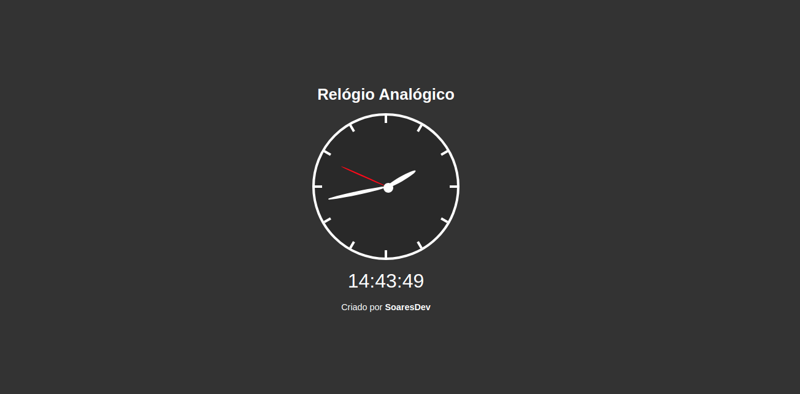

<h2 align="center">
  ⏰ Javascript Analog clock
</h2>

  
  
  

##### :memo: About

This project is about an analog clock that updates in real time according to the hours, minutes and seconds.

##### 🎨 Preview

  

